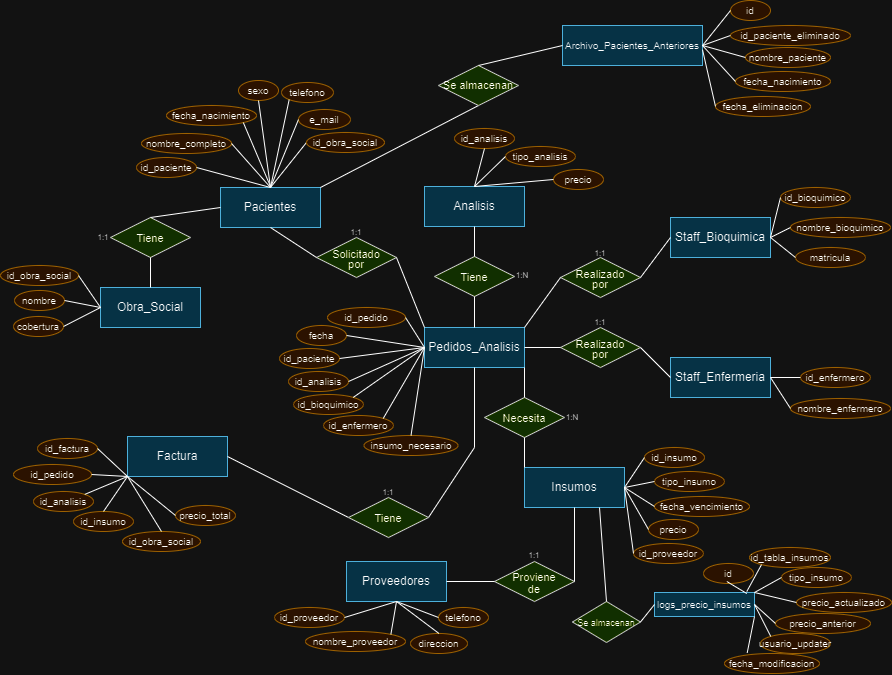

# CoderHouse_SQL_Proyecto_Final-Nieto

# CoderHouse - Curso SQL: Proyecto Final
## Victor Daniel Nieto


# Proyecto_Laboratorio


## Introducción y descripción de la temática:
En este proyecto me propongo trabajar a partir de una problemática relacionada a la administración de un laboratorio de análisis clínicos. Esta idea se origina a partir de un interés personal por este modelo de negocio relacionado al ámbito de la salud. Dicho interés surge a través de un vínculo familiar y me gustaría aprovechar lo aprendido a lo largo del curso para plantear una aplicación de un proyecto basado en un laboratorio real.


## Objetivos:
A lo largo de las distintas entregas del proyecto el objetivo principal fue la implementación de una base de datos que fuera funcional al modelo de negocio de un laboratorio de análisis clínicos.
En la primera instancia el objetivo estuvo centrado principalmente en la creación de una base de datos que permitiera almacenar de manera óptima la información sobre los distintos pedidos de análisis que se realizan en el laboratorio.
Luego en la segunda instancia, junto con esta presentación final, el objetivo fue llevar a cabo la inserción de datos y el trabajo el trabajo a partir de estos junto a la creación de distintos objetos de la base de datos. La idea a partir de todo esto es poder aportar a una mejora en la eficiencia del trabajo para el modelo de negocio elegido; trabajar con la base de datos y el lenguaje SQL para realizar consultas, el mantenimiento y la optimización de la DB; y aprovechar esto para una posible utilización en una etapa analítica del negocio y la toma de decisiones.


## Diagrama Entidad-Relación (D-E-R)




## Listado de tablas:
```
•   Analisis: Contiene la lista de análisis clínicos que pueden realizarse en el laboratorio y el precio de cada uno.
    o	id_analisis
    o	tipo_analisis
    o	precio

•	Staff_Bioquimica: Almacena información sobre los empleados del área de bioquímica.
    o	id_bioquimico
    o	nombre_bioquimico
    o	matricula

•	Staff_Enfermeria: Almacena información sobre los empleados del área de enfermería.
    o	id_enfermero
    o	nombre_enfermero

•	Insumos: Almacena información sobre los insumos necesarios para los análisis clínicos.
    o	id_insumo
    o	tipo_insumo
    o	fecha_vencimiento
    o	precio
    o	id_proveedor

•	Proveedor: Contiene la lista de proveedores de los cuales se obtienen los insumos así como datos generales de contacto de los mismos.
    o	id_proveedor
    o	nombre_proveedor
    o	direccion
    o	telefono

•	Pacientes: Almacena información sobre los pacientes que se realizan análisis clínicos.
    o	id_paciente
    o	nombre_completo
    o	fecha_nacimiento
    o	sexo
    o	telefono
    o	e_mail
    o	id_obra_social

•	Obra_Social: Contiene la lista de obras sociales con las cuales trabaja el laboratorio y la cobertura que proporciona cada una con respecto al precio de los análisis.
    o	id_obra_social
    o	nombre
    o	cobertura

•	Pedido_Analisis: Almacena información sobre los pedidos de análisis clínicos que se realizan en el laboratorio.
    o	id_pedido
    o	fecha
    o	id_paciente
    o	id_analisis
    o	id_bioquimico
    o	id_enfermero
    o	insumo_necesario

•	Factura: Registra las facturas emitidas por cada pedido de análisis.
    o	id_factura
    o	id_pedido
    o	id_analisis
    o	id_insumo
    o	id_obra_social
    o	precio_total

•	Archivo_Pacientes_Anteriores: Almacena información sobre pacientes eliminados de la tabla principal de pacientes y el momento en que se realizó dicha eliminación.
    o	id
    o   id_paciente_eliminado
    o   nombre_paciente
    o   fecha_nacimiento
    o   fecha_eliminacion

•	logs_precio_insumos: Tabla de auditoría que almacena información sobre las actualizaciones de los precios de los insumos, mostrando también la comparación con el precio anterior y datos sobre el usuario que realizó la actualización y cuando se realizó.
    o	id
    o   id_tabla_insumos
    o   tipo_insumo
    o   precio_actualizado
    o   precio_anterior
    o   usuario_updater
    o   fecha_modificacion
```


## Grilla de tablas con campos, tipos de datos y tipos de claves:
```
+--------------------------------------------------------------------------------------------------------------------------+
| Tabla                        | Campo	               | Nombre de campo completo	       | Tipo de dato  | Tipo de clave |
+--------------------------------------------------------------------------------------------------------------------------+
| Analisis                     | id_analisis	       | Identificador análisis	           | INT	       | PK            |
|	                           | tipo_analisis	       | Tipo de análisis	               | VARCHAR (100) |               |
|	                           | precio	               | Precio de análisis	               | DECIMAL (8,2) |               |
+--------------------------------------------------------------------------------------------------------------------------+
| Staff_bioquimica             | id_bioquimico	       | Identificador bioquímico	       | INT           | PK            |
|                              | nombre_bioquimico     | Nombre de bioquímico	           | VARCHAR (60)  |               |
|	                           | matricula	           | Matrícula de bioquímico	       | VARCHAR (25)  |               |
+--------------------------------------------------------------------------------------------------------------------------+
| Staff_enfermeria             | id_ enfermero	       | Identificador enfermero           | INT	       | PK            |
|	                           | nombre_ enfermero     | Nombre de enfermero	           | VARCHAR (60)  |               |	
+--------------------------------------------------------------------------------------------------------------------------+
| Insumos	                   | id_insumo             | Identificador insumo	           | INT	       | PK            |
|	                           | tipo_insumo	       | Tipo de insumo	                   | VARCHAR (100) |               |
|	                           | fecha_vencimiento     | Fecha de vencimiento	           | DATE	       |               |
|	                           | precio	               | Precio de insumo	               | DECIMAL (8,2) |               |
|	                           | id_proveedor	       | Identificador proveedor	       | INT	       | FK            |
+--------------------------------------------------------------------------------------------------------------------------+
| Proveedores	               | id_proveedor	       | Identificador proveedor	       | INT	       | PK            |
|	                           | nombre_proveedor	   | Nombre de proveedor	           | VARCHAR (100) |               |
|	                           | direccion	           | Dirección de proveedor	           | VARCHAR (100) |               |
|	                           | telefono	           | Teléfono de proveedor	           | VARCHAR (20)  |               |
+--------------------------------------------------------------------------------------------------------------------------+
| Pacientes	                   | id_paciente	       | Identificador paciente	           | INT	       | PK            |
|		                       | nombre_completo	   | Nombre completo de paciente	   | VARCHAR (100) |               |
|		                       | fecha_nacimiento	   | Fecha de nacimiento	           | DATE	       |               |
|		                       | sexo	               | Sexo de paciente	               | VARCHAR (9)   |               |
|		                       | telefono	           | Teléfono de paciente	           | VARCHAR (20)  |               |
|		                       | e_mail	               | E-mail de paciente	               | VARCHAR (100) |               |
|		                       | id_obra_social	       | Identificador obra social	       | INT	       | FK            |
+--------------------------------------------------------------------------------------------------------------------------+
| Obra Social                  | id_obra_social	       | Identificador obra social	       | INT	       | PK            |
|	                           | nombre	               | Nombre de obra social	           | VARCHAR (100) |               |
|	                           | cobertura	           | Cobertura de obra social	       | DECIMAL (8,2) |               |
+--------------------------------------------------------------------------------------------------------------------------+
| Pedido_Analisis              | id_pedido	           | Identificador pedido	           | INT	       | PK            |
|		                       | fecha	               | Fecha de pedido de análisis	   | DATETIME	   |               |
|		                       | id_paciente	       | Identificador paciente	           | INT	       | FK            |
|		                       | id_analisis           | Identificador análisis	           | INT	       | FK            |
|		                       | id_bioquimico         | Identificador bioquímico	       | INT	       | FK            |
|		                       | id_enfermero	       | Identificador enfermero	       | INT	       | FK            |
|		                       | insumo_necesario	   | Insumo necesario para análisis    | INT	       | FK            |
+--------------------------------------------------------------------------------------------------------------------------+
| Factura                      | id_factura	           | Identificador factura	           | INT	       | PK            |
|	                           | id_pedido	           | Identificador pedido	           | INT	       | FK            |
|	                           | id_analisis	       | Identificador análisis	           | INT	       | FK            |
|              	               | id_insumo	           | Identificador insumo	           | INT	       | FK            |
|	                           | id_obra_social	       | dentificador obra social	       | INT	       | FK            |
|	                           | precio_total	       | Precio total	                   | DECIMAL (8,2) |               |	
+--------------------------------------------------------------------------------------------------------------------------+
| Archivo_Pacientes_Anteriores | id     	           | Identificador de tabla   	       | INT	       | PK            |
|	                           | id_paciente_eliminado | Identificador paciente eliminado  | INT	       | FK            |
|	                           | nombre_paciente	   | Nombre completo de paciente	   | VARCHAR (100) |               |
|	                           | fecha_nacimiento      | Fecha de nacimiento               | DATE	       |               |
|	                           | fecha_eliminacion     | Fecha de eliminación	           | DATETIME      |               |
+--------------------------------------------------------------------------------------------------------------------------+
| logs_precio_insumos          | id	                   | Identificador de tabla	           | INT	       | PK            |
|	                           | id_tabla_insumos      | Identificador insumo	           | INT	       | FK            |
|	                           | tipo_insumo	       | Tipo de insumo	                   | INT	       |               |
|	                           | precio_actualizado    | Precio actualizado de insumo	   | DECIMAL (8,2) |               |
|	                           | precio_anterior	   | Precio anterior de insumo	       | DECIMAL (8,2) |               |
|	                           | usuario_updater	   | Usuario que realizó actualización | VARCHAR (100) |               |	
|	                           | fecha_modificacion	   | Fecha de modificación	           | DATETIME      |               |
+--------------------------------------------------------------------------------------------------------------------------+
```


## Inserción de datos:
Con respecto a la inserción de datos en la base de datos creada en la primera entrega del proyecto aproveché en mayor medida el recurso de la plataforma [Mokaroo](https://www.mockaroo.com/) para crear datos de forma aleatoria siguiendo ciertos parámetros que fueran funcionales para las tablas que había creado. Por otro lado también utilicé algunos tipos de análisis clínicos y precios aproximados calculados a partir del índice NBU (Nomeclador Bioquímico Único) obtenido a través de la biblioteca digital de la Confederación Unificada Bioquímica de la República Argentina [(CUBRA)](https://cubra.org.ar/biblioteca/).

El script de inserción de datos mediante un archivo .sql se encuentra en el repositorio con el nombre 'Insercion_Datos.sql'. El orden de inserción en las tablas es el planteado en el script, este mismo fue probado en MySQL Workbench y funciona correctamente ejecutando el script entero. Una aclaración sobre cambios realizados en la segunda entrega que están presentes en el script es la modificación del tipo de dato de dos columnas pertenecientes a dos tablas. Por un lado modifiqué la columna cobertura de la tabla Obra_Social cambiando el tipo de dato a VARCHAR para que pudiera ingresar valores numéricos más el símbolo de porcentaje, y por otro lado, modifiqué la columna id_obra_social de la tabla Pacientes permitiendo que admita valores nulos. En este último caso lo hice considerando que posteriormente pudiera recibir valores nulos equivalentes a pacientes que no tengan una obra social.


## Objetos de la DB:
A continuación se detallan cada uno de los objetos que creé para la base de datos con información sobre su funcionamiento y ejemplos de uso. Antes hago una aclaración sobre la ejecución de los scripts de los objetos, la forma en la que probé varias veces haciendo un DROP de toda la DB y volviéndo a crear todo lo hice siguiendo el orden en el que fueron dados los contenidos en el curso: vistas, funciones, stored procedures y triggers. Otra cuestión importante a mencionar es que a raíz de estos objetos están incluídos en los scripts de stored procedures y triggers la creación de dos tablas nuevas, Archivo_Pacientes_Anteriores y logs_precio_insumos respectivamente.
Así mismo menciono que en los scripts de cada objeto hay breves títulos descriptivos y ejemplos de uso mediante comentarios.

## Documentación de vistas

## Vista: view_pacientes__por_obra_social
Descripción: Esta vista muestra todos los pacientes que tienen obra social, a cual pertenecen y muestra su id de la tabla Pacientes.

Columnas:
* Obra_Social
* Id_Paciente
* Nombre_Paciente

Ejemplo de uso:
```sql
SELECT * FROM proyecto_laboratorio.view_pacientes__por_obra_social;
```

## Vista: view_pacientes_obra_mayor_cobertura
Descripción: Esta vista muestra principalmente datos de contacto de los pacientes que tienen la obra social de mayor cobertura.

Columnas:
* Id_Paciente
* Nombre
* Telefono
* Correo_Electronico

Ejemplo de uso:
```sql
SELECT * FROM proyecto_laboratorio.view_pacientes_obra_mayor_cobertura;
```

## Vista: view_pedidos_mayo_julio
Descripción: Esta vista está pensada para mostrar información breve sobre los pedidos de análisis de los últimos tres meses, que en el caso de los datos cargado corresponden a mayo, junio y julio.

Columnas:
* Id_Pedido
* Fecha
* Id_Paciente
* Nombre_Paciente

Ejemplo de uso:
```sql
SELECT * FROM proyecto_laboratorio.view_pedidos_mayo_julio;
```

## Documentación de funciones

## Función: edad_paciente
Descripción: Esta función retorna la edad de un paciente ingresando su id.

Parámetro:
* id_paciente: Identificador del paciente.

Retorno:
* Edad del paciente calculando a partir de su fecha de nacimiento.

Ejemplo de uso:
```sql
SELECT Proyecto_Laboratorio.edad_paciente(1)
AS Edad_Paciente;
```

## Función: pedidos_bioquimico
Descripción: Esta función retorna los pedidos de análisis asignados a un bioquímico específico, el cual es indicado mediante su nombre.

Parámetro:
* bioquimico: Nombre del bioquímico tal cual figura registrado en la tabla Staff_Bioquimica

Retorno:
* Lista de pedidos que el bioquímico indicado tiene asignados.

Ejemplo de uso:
```sql
SELECT Proyecto_Laboratorio.pedidos_bioquimico ('Eda Sawell');
```

## Documentación de stored procedures (procedimientos almacenados)

## Stored procedure: sp_eliminacion_archivo_paciente
Descripción: Este stored procedure almacena en la tabla Archivo_Pacientes_Anteriores los pacientes que queremos eliminar de la tabla Pacientes. Luego de almacenar en la tabla primeramente mencionada elimina los registros del paciente indicado de la tabla Pacientes y también de la tabla Pedidos_Analisis por la relación de FK mediante constraint.

Parámetro:
* id_paciente: Identificador del paciente que deseamos eliminar.

Ejemplo de uso:
```sql
CALL Proyecto_Laboratorio.sp_eliminacion_archivo_paciente (5);
```
Sentencias para visualizar tablas involucradas luego de ejecución del stored procedure:
```sql
SELECT * FROM Proyecto_Laboratorio.Archivo_Pacientes_Anteriores;
SELECT * FROM Proyecto_Laboratorio.Pacientes;
```


## Stored procedure:
Descripción: Este stored procedure actualiza el valor de cobertura de la obra social que indiquemos. El valor ingresado como cobertura_actualizada solo admite cuatro caracteres pensado para un valor númerico de 0 a 100 más el signo porcentual (%).

Parámetros:
* id_obra_social: Identificador de la obra social.
* cobertura_actualizada: Nuevo valor cobertura de la obra social.

Ejemplo de uso:
```sql
CALL Proyecto_Laboratorio.sp_actualizacion_cobertura (3, '35%');
```
Sentencias para visualizar tabla involucrada luego de ejecución del stored procedure:
```sql
SELECT * FROM Proyecto_Laboratorio.Obra_Social;
```

## Documentación de triggers

## Trigger: trg_checker_paciente_contacto
Descripción: Este trigger de tipo checker está pensado para validar la actualización de los medios de contacto de los pacientes. Al realizarce una actualización en la tabla Pacientes verifica que no queden nulos los campos que corresponden al teléfono o al correo electrónico. Solo permite que haya nulidad en uno de los campos y en caso de intentar dejar ambos en nulo se genera un error con el mensaje 'Solicitar medio de contacto' y la actualización no se realiza.


Ejemplo de uso para comprobar error y mensaje de signal sqlstate:
```sql
UPDATE Proyecto_Laboratorio.Pacientes
SET telefono = NULL
WHERE id_paciente = 10;
```

## Trigger:
Descripción: Este trigger de manera similar al caso anterior está pensado para validar una acción DML en la tabla pacientes, pero en este caso pensado para el momento de insertar nuevos pacientes. Al realizarce una inserción verifica que no queden nulos ambos campos: telefono e e_mail. En este caso también se genera un error en caso de que esto no se cumpla y devuelve el mensaje: 'Es necesario algún medio de contacto'.


Ejemplo de uso de uso para comprobar error y mensaje de signal sqlstate:
```sql
INSERT INTO Proyecto_Laboratorio.Pacientes
(nombre_completo,
fecha_nacimiento,
sexo,
telefono,
e_mail,
id_obra_social)
VALUES
('Paciente_Prueba', '1949-10-21', 'M', NULL, NULL, 5);
```

## Trigger: trg_logger_actualizacion_insumos
Descripción: Este trigger de tipo 'logger' está pensado para ir guardando un registro de los precios de insumos al ser actualizados. Este trigger realiza una inserción en la tabla logs_precio_insumos cada vez que se realiza una actualización en la tabla Insumos. La tabla que va logs_precio_insumos está pensada a modo de tabla de auditoría y almacena información sobre el id del insumo modificado, el tipo de insumo, el precio actualizado y el anterior, el usuario que realizó la actualización y el momento en el que fue realizada dicha actualización.


Ejemplo de uso para comprobar error y mensaje de signal sqlstate:
```sql
UPDATE Proyecto_Laboratorio.Insumos
SET precio = 625.00
WHERE id_insumo = 2;
```
Sentencias para visualizar tablas involucradas:
```sql
SELECT * FROM Proyecto_Laboratorio.Insumos;
SELECT * FROM Proyecto_Laboratorio.logs_precio_insumos;
```